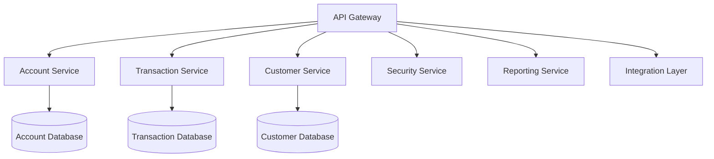

# Core Banking System Overview

## Overview of a Typical Core Banking System

A core banking system is the central processing unit of a digital bank, handling all fundamental banking operations. It manages customer accounts, processes transactions, and supports various banking services through a unified platform. For a digital bank like The Amazing Bank, the core banking system must be highly scalable, secure, and capable of integrating with modern technologies like AI, blockchain, and real-time analytics.

Key features include:
- Account management (savings, checking, loans, etc.)
- Transaction processing (deposits, withdrawals, transfers)
- Customer relationship management
- Integration with digital channels (mobile, web)
- Compliance and security features
- Reporting and analytics

## Architecture Description

The core banking system follows a microservices architecture to ensure scalability and flexibility. Key components include:

1. **API Gateway**: Handles all incoming requests and routes them to appropriate services
2. **Account Service**: Manages customer accounts and balances
3. **Transaction Service**: Processes financial transactions
4. **Customer Service**: Handles customer profiles and relationships
5. **Security Service**: Manages authentication, authorization, and encryption
6. **Reporting Service**: Generates financial reports and analytics
7. **Integration Layer**: Connects with external systems and third-party services

## Scenario List

| Scenario | Description | Actors | Preconditions | Postconditions |
|----------|-------------|--------|---------------|----------------|
| Account Creation | Customer creates a new bank account | Customer, Account Service | Customer is authenticated | New account is created and linked to customer profile |
| Deposit | Customer deposits funds into account | Customer, Transaction Service | Account exists and is active | Account balance is increased |
| Withdrawal | Customer withdraws funds from account | Customer, Transaction Service | Account exists and has sufficient balance | Account balance is decreased |
| Transfer | Customer transfers funds between accounts | Customer, Transaction Service | Both accounts exist and source account has sufficient balance | Funds are moved from source to destination account |
| Balance Inquiry | Customer checks account balance | Customer, Account Service | Account exists | Current balance is displayed |
| Loan Application | Customer applies for a loan | Customer, Account Service | Customer meets eligibility criteria | Loan account is created and funds are disbursed |
| Fraud Detection | System detects suspicious activity | Security Service, Transaction Service | Transaction patterns are monitored | Suspicious transactions are flagged for review |
