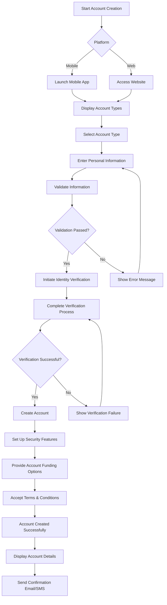
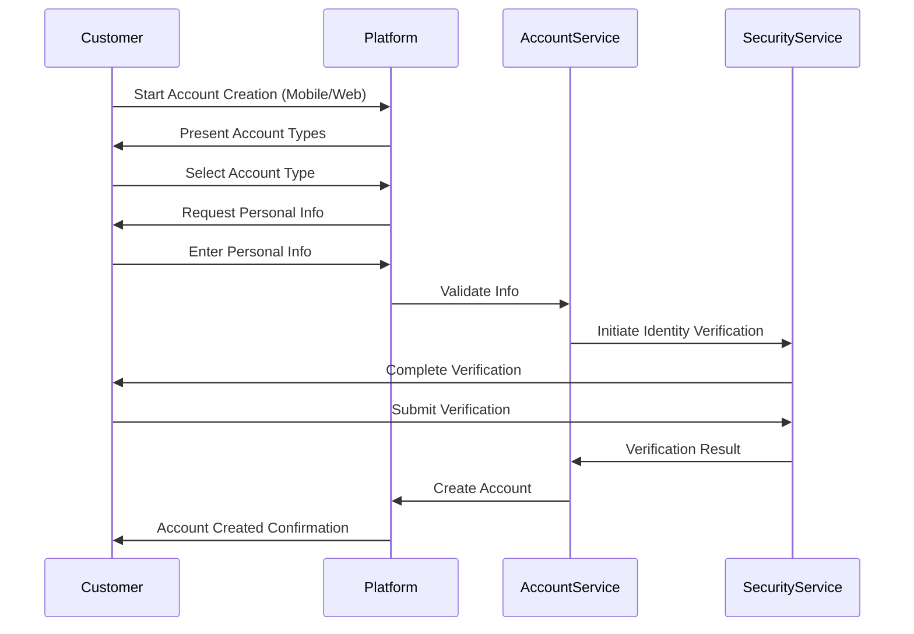

# PRD: Account Creation Process

## Objective/Goal
The Account Creation process aims to:
- Provide a seamless digital onboarding experience for new customers
- Reduce account setup time to under 5 minutes
- Implement robust identity verification and security measures
- Support multiple account types (savings, checking, etc.)
- Enable account creation across both mobile and web platforms

## Features

### 1. Account Type Selection
**Description**: Allow users to select their desired account type
**Goal**: Provide clear options and guidance for account selection
**Use Case**: New customer chooses between savings and checking accounts

### 2. Personal Information Collection
**Description**: Gather necessary personal information for account creation
**Goal**: Collect accurate user data while maintaining privacy
**Use Case**: User enters name, address, and contact information

### 3. Identity Verification
**Description**: Verify user identity through secure methods
**Goal**: Prevent fraud while maintaining user convenience
**Use Case**: User uploads government-issued ID and takes a selfie

### 4. Security Setup
**Description**: Establish account security features
**Goal**: Protect user accounts from unauthorized access
**Use Case**: User creates password and sets up two-factor authentication

### 5. Account Funding Options
**Description**: Provide options for initial account funding
**Goal**: Enable quick and easy account activation
**Use Case**: User links external bank account or uses debit card

### 6. Terms & Conditions Acceptance
**Description**: Present and record user agreement to terms
**Goal**: Ensure legal compliance and user understanding
**Use Case**: User reviews and accepts account terms

## UX Flow & Design Notes

### Process Flowchart

### UX Flow Sequence Diagram

### Design Considerations
- Consistent UI/UX across platforms
- Responsive design for various screen sizes
- Accessibility compliance (WCAG 2.1 AA)
- Clear error messaging and recovery paths
- Progress indicators for multi-step process

## System & Environment Requirements

### Mobile
- iOS 15+
- Android 10+
- Minimum RAM: 2GB

### Web
- Browsers: Chrome, Safari, Firefox (latest versions)
- Minimum Screen Resolution: 1024x768
- Internet Connection: 4G/LTE or WiFi

## Assumptions, Constraints & Dependencies

### Assumptions
- Users have access to a smartphone or computer
- Identity verification service is available
- Integration with core banking system is complete

### Constraints
- Maximum concurrent users: 10,000
- Time limit for account creation session: 30 minutes
- Maximum file size for ID upload: 5MB

### Dependencies
- Identity verification service API
- Core banking system integration
- Email/SMS notification service
- Payment gateway for account funding
